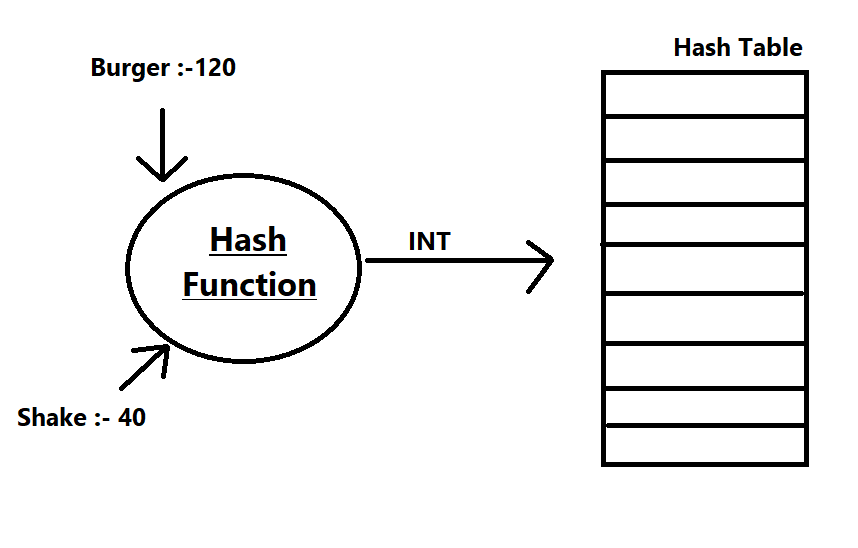
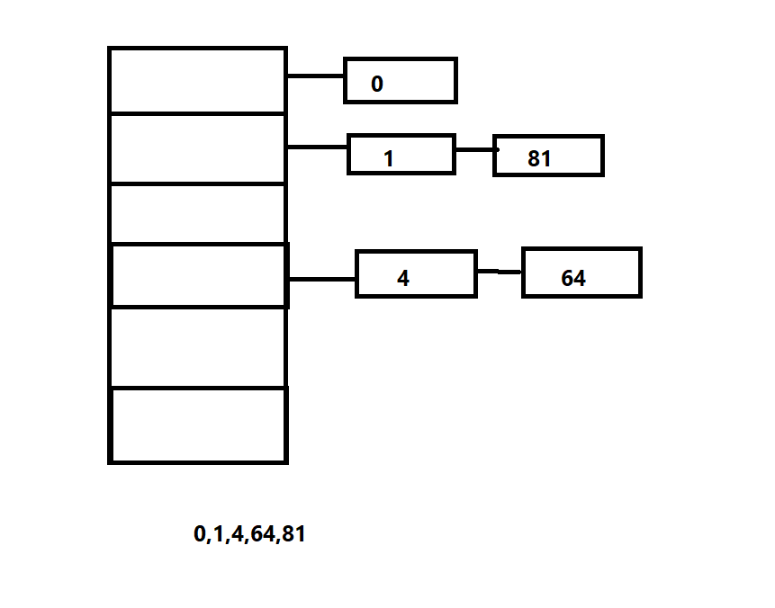

# Hashing/Hash Table Data Structure
Suppose you visit a restaurant.You want to order few item. 
 i.  Burger :- 120  
 ii. Shake :- 80 
 ii. Noodles :- 90 
 
To find the price of burger one way you can do the linear search.But it 
isnt efficient.So you can the waiter and he will reply you in a instant.
This happens because he has a mapping of price and food in his mind.
So you are making a search query and it should be done in O(1) time. 
This is the purpose of HashTable.

## Purpose 
    1. To Perform Insertion,deletion and search in average-case constant time.
    2. This data-structure isnt useful for if you want to maintain and retrieve
       some kind of an order of the elements.

## Hash Function
    1.  Hash["string key"] ==> Integer Value

## Key Components
    1.  Hash Function
    2.  Hash Table
    3.  Collision Handling Scheme
    
    
    
 Suppose you want to add burger and the value 120 in the hash table.As shown in
fig, there is a function which take input as string and give output as INT 7.
So we store the Burger with value 120 at index 7 of table.
Since Hash table size if fixed.So we must keep in consideration the Key values
lies withing the range.So for this we take out key value mod with table size.
If two function have same key value then there occurs a collision.

## Hash Function
   
Collision cannot be avoided but it chances can be minimized by using 
a good hash function. 
    
    1.Simple Hash function
        h(key)=key%TableSize
    It is suggested to use prime number for Table Size.Because Multiples are 
    less compared to others. Suppose if Table size is 10. Then MOD 10,20,30
    all result to zero.
         
    2.String Hash Function
      Add up ASCII values of characters of string to produce integer keys.But 
      problem will arise in case of anagrams.Because they both have the same 
      ASCII value.Small string maynt fill the table size.
                                                         So to overcome this
      we can use a apporach in which we will sum str[i]*pow(prime,i) upto
      the length-1.And then we will take mod with table size.To make it Fit for
      the table.
   ## Collision Handling Schemes
 
  ### Open Hashing (Seperate Chaining)
  
   Implemented Using Linked List 
   hash function= NO%10  
             
            
    To insert a element with particular key. We create a node at that particular
    position and insert the element.The key position contain the address of node.
    So in chaining for multiple node with same hash value we create a linked List.
    If there are too many collision the linked list will be very large.So we are going
    to ensure the length of linked list isnt large.
    
   #### Check HashImplementation.cpp

## Rehashing
Lets understand what is Rehashing and why it is needed.
Suppose you have a table of 10 buckets.And you insert 20 element then there is a chance
of collision. One way is to increase the table size as element increases.
 #### Check rehashing.cpp

 
So we can define a load factor. 

#### Load Factor = ratio of(CS/TS)
If Load Factor becomes greater than threshold(0.75) then this is the time to increase the bucket
size.So we are going to find the next prime number which is near to double of size of old 
hash table. All the previous element in the old table must be rehashed.
Steps Involved:-
    
    1. Calculate Load Factor. 
    {
        If LF>threshold {
            1.Create a new table of size 2*oldsize.
            2.Shift elements from old table to new table
            3.Delete old table.
        }
    }
    
 We need to rehash everything because table size has changed.We cant extend once the table size
is allocated.So we need to create a new table and rehash it.And this is going to be expensive
operation.And it is atleast going to take time O(N).

## Search 
Suppose you have a hash table and you are looking for berger and want to know it price.So you
have been given a key and you want to know the associated value with it.So key is Berger.So
using the HASH Function we get the index of node. We traverse the node and search for the key.
In case if the item is not found then we will return a pointer which will point to NULL.

## Operator Overloading
Here we will see operator overloading to make our hash table work easier.
 
//Insert
price_menu["Dosa"]  = 60;
 
//Update
price_menu["Dosa"] += 10;
 
//Search
cout<<price_menu["Dosa"]<<endl;
 

I want to support these three operation in hash table. 
### What operators to overload and how ?? 
First we check is the key is present or not. If not we simply create the new node where Dosa is
the key and some random garbage as the value.This node is returned by reference. 
The node is of data-type T. So to return it by reference we use &.If we dont use & it will return
the copy of T and value cant be updated. 
 
#### Check operatoverload.cpp

  
    
         
     
