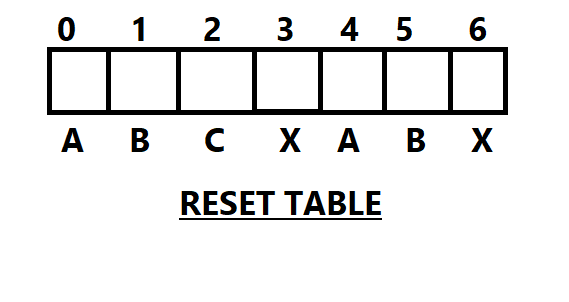

# String Matching
There is a string and a pattern. Whethere the pattern pat is substring of the given string str or not.  
Here we slide the pattern over text one by one and check for a match. If a match is found, then slides by 1 again to check for subsequent matches.
Complexity O(N^2)
## Rabin Karp ALgorithm [Average Case :- O(n+m)]
It is based on rolling hash technique. Suppose we have a hash function and
which take a input string and gives a unique hash.
Let 
   str -> ababcabdab
   hash(str) --> x
   hash("babc") --> y
   str[1,4]-->babc
   If we know the hash value of given sub-string starting from index i and ending 
   at index j.
   If we want to know the hash value of given sub-string starting from index i+1 and ending 
   at index j+1. Then we can get this is O(1).
   
   Suppose for the string index from 0 to 2.The sub-string is "aba".There is a
   hash function which only does the simple thing that adds the ASCII value of
   characters. ASCII a+b+a :- 97+98+97=292.
                                          We can calulate the hash value of 
    index i+1 to j+1 in O(1). a+b+a-a+b=292-97+98=293.
    
   ### Algorithm
    
    Hash(str)
    1.Calcualte the hash of pattern.
    2.Calcualte of the hash of the sub-string of given string.[0,patsize-1].
    These two step will take O(m).Where m is size of pattern.
    
    At each step we will check the hash of pattern is equal to hash of the
    sub-string. 
     (i)If the match is found then for double checking we will iterate over
        the whole pattern and sub-string characters by characters.If all the 
        characters matches then we found a pattern.
    (ii)If the match is not found then we will shift the windows
        to str[i+1,j+1] hash value.
        
    The ALgorithm can be shortened in these steps :-
    1. Initially calculate the Hash value of pattern and the first sub-string.
    2.Try to iterate over the whole given sub-string in particular window-size.
      Then,we will check if our current hash-value matches the hash-value of 
      pattern. If it matches we will double check by iterating over the pattern
      and sub-string characters by characters.If all the characters matches then
      we found a pattern.
    In worst case if every sub-string has the same hash value as of pattern.
    Then this will also take same complexity as brute force. O(n*m).

## KMP Algorithm O(n+m)
It is a modification of Rabin Karp's Algorithm.
String :- ABAABCXABCXABXA
Pattern :- ABCXABX
In case of Rabin Karp we start comparsion from the index 0 of string and 0 of pattern.If there is 
a match we increase i and j. If at any point of time if there is mismatch we initialise j=0 and 
i=i+1. And we perform the same step again. But this turns out to be a expensive approach in terms
of Time Complexity. 
                   Suppose at any point of time i reaches 3. Here,
                    str[3]=pat[0],str[4]=pat[1],str[5]=pat[2],str[6]=pat[3]
                    str[7]=pat[4],str[8]=pat[5],str[9]!=pat[6]
                    So the next iteration will start from 4. 
                    So Complexity = O(n.m) 
                     
So KMP Algorithm will make sure that we arent recomputing any of the iteration we have done before.
For this we will create the reset table.In reset table at every index what is the length of longest
suffix present till now which is also present as prefix in the pattern.
 
1. No Recomputation
To avoid recomputatuon we create a reset table.
At every index we will store what is length of longest suffix present till now viz also present 
as a prefix in the pattern.

   Steps:- 
   
      1.KMPpreprocess
      Here we create the reset table using the pattern.Take two pointer i,j.Initialise i=0 & j=-1.Iterate
      till the length of the pattern.This table will store what is length of longest suffix present till now which is
      also present as a prefix in the pattern.
      PseudoCode
            KMPpreprocess(patttern)	
          i=0,j=-1,reset[0]=-1;
          while(i<patternlength){
            while(j>=0 and pattern[i]!=pattern[j]){
               j=reset[j];
            }
          }
          i++;
          j++;
          reset[i]=j;
          }
      2.KMPsearch or Matching
      Here the main task occurs.We recieve here both the pattern and the string.We call the KMPprocess function and 
      compute the reset table.With the help of reset table we perform our task.Here we simply iterate over the string
      till there is no mismatch and print the index of i-j to get the pattern index.But if there occurs a mismatch we
      use the reset table and check if there is any prefix for the suffix and begin the jth index from that position 
      to avoid recomputation.
        PseudoCode
           KMPsearch(str,pat)
          KMPpreprocess(pat);
            i=0,j=0;
                 while(i<str.size()){
                  while(j >= 0 && str[i]!=pat[j]){
                        j=reset[j];
                  }
                  i++;
               j++;
                  if(j==pat.size()){
                   cout<<"Pattern is found at"<<i-j<<endl;
                   j=reset[j];
                       }
            }

